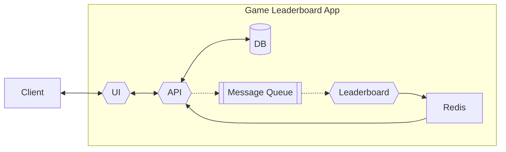

# Game Leaderboard App

[](https://github.com/ckng0221/game-leaderboard/actions/workflows/ci.yml)

Game Leaderboard App is a proof of concept (POC) leaderboard application, for providing a real-time leaderboard of top K players with the highest scores.

The system is designed to solve the "top-k problem", where it is compute-intensive to compute the total scores and sort the large of amount of records (eg. gameplay records of millions of users) in a regular relational database, as requires to sum and sort all rows of data upon every query.

The applicaiton is written in [Go](https://go.dev/) (API, Leaderboard) and [TypeScript](https://www.typescriptlang.org/) (UI), consiting the following services:

- `API`: Handles the main REST API endpoints for CRUD operations, and as the API gateway for the Leaderboard service.
- `Leaderboard`: Handles the leaderboard service and update the Leaderboard sorted sets in Redis.
- `UI`: The UI of the application for user interactions.



# How it works

Upon each gameplay, the gameplay record of the user is added to the relational database (MySQL). At the same time, an event consisting the user id and score will be emitted from the `API` service (publisher) , and will be sent to a message queue (RabbitMQ), using pub-sub mechanism.

The `Leaderboard` service (subscriber) receives the event from the message queue, and update the Leaderboard sorted set in the Redis database.

When a user is checking the top-k leaderboard on the `UI`, a request is sent to the `API` service, and the `API` service will query the top-k sorted set from the Redis database.

A separate record of the users of a particular month will also be stored in the relational database. The Redis Leaderboard will also be resetted at the begining of every month, using with a cron job.

# Tech Stack

## API, Leaderboard

- Programming Language: [Go](https://go.dev/)
- Server Framework: [Gin](https://gin-gonic.com/)
- ORM: [Gorm](https://gorm.io/)
- Database: [MySQL](https://www.mysql.com/)
- Sorted Set : [Redis](https://redis.io/)
- Message Broker : [RabbitMQ](https://www.rabbitmq.com/)

### UI

- Programming Language: [TypeScript](https://www.typescriptlang.org/)
- JavaScript library: [React](https://react.dev/)
- CSS Framework: [Tailwind CSS](https://tailwindcss.com/)
- UI Library: [Material UI](https://mui.com/)
- Hosting: [Nginx](https://nginx.org/en/)

### Build

- CI Platform: [GitHub Actions](https://github.com/features/actions)
- Multi-container Tool: [Docker Compose](https://docs.docker.com/compose/)

## Getting Started

### Installation

```bash
# At the project root

$ npm install

# Install Go dev dependencies
$ go get github.com/githubnemo/CompileDaemon
$ go install github.com/githubnemo/CompileDaemon
```

Before running application, rename the `.env.example` files to `.env`, and update the environment variables accordingly.

## Run application

### On local

To run the application locally, ensure that `MySQL`, `RabbitMQ`, and `Redis` are installed beforehand.

```bash
# At project root
# Development mode
make -j3 server_dev

# Build
make -j3 build

# Production mode
make -j3 server_prod

# Alternatively, you can navigate to the root of each application (e.g., ./apps/api) and run the npm scripts to run the particular application only.
```

### With docker and docker compose

To run the application using Docker, ensure that `Docker` and `Docker Compose` are installed beforehand.

```bash
# Create docker images and run docker containers in detached mode
docker compose up -d

# Stop and remove containers
docker compose down

# To access the docker applications on local, could browser:
http://game-leaderboard.127.0.0.1.nip.io
```
